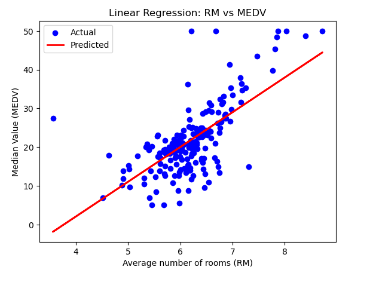

# Linear Regression Model

It's a simple Linear Regression model which predicts the price(MEDV) using the RM.(Dataset is added in repository).

**Text Editor - Jupyter Notebook**  
**Data set -**
[**_kaggle_**](https://www.kaggle.com "Kaggle wesite link")  
**Programming Language - Python**

## Libraries

1. Pandas
2. Matplotlib
3. Scikit-learn

## Graph of Actual vs Predicted



## Installation

```bash
git clone https://github.com/Nihaldixit/Linear-Regression-model.git
```
